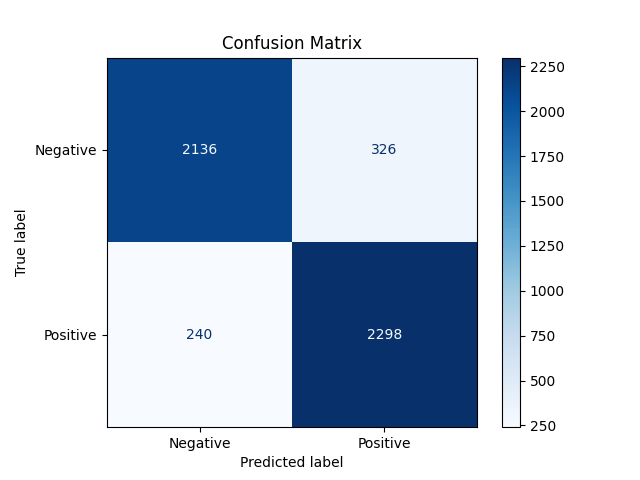
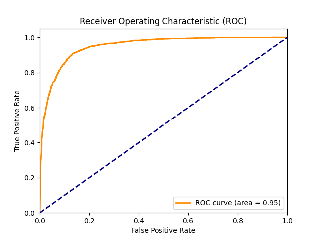

# **Sentiment Analysis on Movie Reviews**

## **Content**
- [Introduction](#introduction)
- [Problem Statement](#problem-statement)
- [Goals](#goals)
- [Project Structure](#project-structure)
- [Project Approach](#project-approach)
- [Model Evaluation](#model-evaluation)
- [Prediction Function](#prediction-function)
- [Conclusion](#conclusion)

## **Introduction**
The exponential growth of online content has made it crucial for businesses and organizations to understand public opinion and sentiment. Movie reviews, in particular, play a significant role in determining the success of films and providing insights into audience preferences. Sentiment analysis, a Natural Language Processing (NLP) technique, allows us to analyze large volumes of textual data and determine whether the underlying sentiment is positive or negative.

## **Problem Statement**
Understanding customer sentiment from reviews is crucial for businesses, especially in the entertainment and media industry. This project aims to classify movie reviews as positive, neutral or negative using NLP techniques. This classification helps in understanding audience reactions and enhances decision-making processes for marketing and content creation.

## **Goals**
- Build a sentiment analysis model that accurately classifies movie reviews into positive or negative categories.
- Demonstrate proficiency in NLP techniques such as text preprocessing, tokenization, and sentiment classification.
- Evaluate the model’s performance using metrics such as accuracy and F1-score, and visualize results.
- Create a prediction function for real-time sentiment analysis.

## **Project Structure**
1. **data/**
    - Contains raw and processed data:
        - `IMDB Dataset.csv`
        - `train_data.zip`
        - `val_data.zip`
        - `test_data.zip`

2. **notebooks/**
    - Jupyter notebooks for analysis, model building, and evaluation.

3. **src/**
    - Source code for predicting sentiments, including `predict_sentiment.py`.

4. **models/**
    - Trained models.

5. **reports/**
    - Evaluation reports and visualizations.

6. **README.md**
    - Project overview and details.

## **Project Approach**
1. **Data Collection:**
    - Utilized the IMDb Movie Reviews dataset from Kaggle, consisting of 50,000 labeled movie reviews (positive or negative).

2. **Text Preprocessing:**
    - **Data cleaning:** Removed unnecessary characters, lowercased text, and handled punctuation.
    - **Tokenization:** Split text into individual words.
    - **Stopword removal:** Eliminated common words that do not contribute much to sentiment.
    - **Lemmatization:** Reduced words to their base or root form to enhance feature quality.

3. **Feature Extraction:**
    - Applied TF-IDF to represent the text numerically, limiting to the top 5,000 features.

4. **Model Building:**
    - Experimented with machine learning models, specifically:
        - **Naive Bayes:** Achieved a validation accuracy of **85.44%** with an F1-score of **0.85**.
        - **Deep Neural Network (DNN):** Achieved a higher test accuracy of **88.68%** with an ROC curve AUC of approximately **0.9498**.

5. **Model Selection:**
    - The DNN model was selected for the prediction function due to its superior performance in terms of accuracy and AUC metrics compared to the Naive Bayes model.

## **Model Evaluation**
1. **Model Performance Metrics:**
    - **Naive Bayes:**
        - Validation Accuracy: **85.44%**
        - Test Accuracy: **85.18%**
        - Classification Report: Balanced precision and recall across positive and negative classes.
    - **DNN:**
        - Validation Accuracy: **88.68%**
        - Confusion Matrix: 
        
        - ROC Curve AUC: **0.9498**
        

## **Prediction Function**
- The prediction function is implemented in the file `predict_sentiment.py` located in the `src` directory.
- To use the prediction function from the terminal, follow these steps:
    1. Navigate to the `src` directory:
    ```bash
    cd src
    ```
    2. Run the script with a movie review as an argument:
    ```bash
    python predict_sentiment.py "The movie was quite dull and boring."
    ```
    3. Output
    ```plain text
    Sentiment: Negative, Probability: 5.776546986337104e-17
    ```

- The function processes the input review, transforms it using the saved TF-IDF vectorizer, and returns the predicted sentiment (positive, negative, or neutral) along with the associated probability.

## **Conclusion**
This project demonstrates the effectiveness of Natural Language Processing techniques in performing sentiment analysis on movie reviews. By leveraging machine learning models, particularly a Deep Neural Network, we were able to achieve a high level of accuracy and reliability in sentiment classification. The developed prediction function provides a valuable tool for real-time sentiment analysis, which can be beneficial for businesses in understanding customer opinions and enhancing their marketing strategies.
